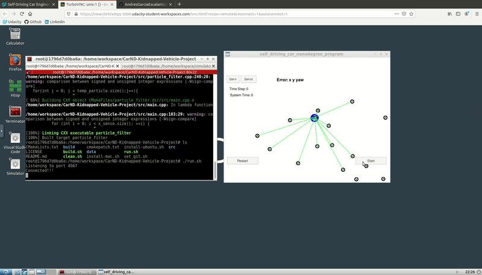
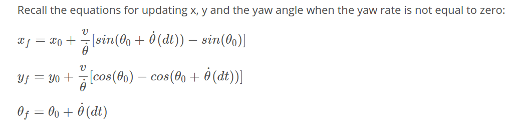
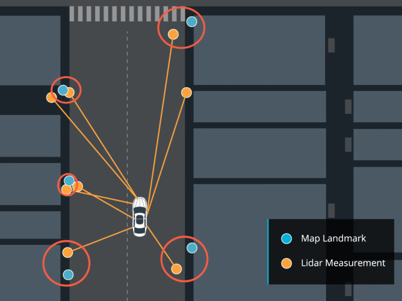
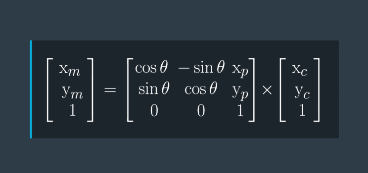
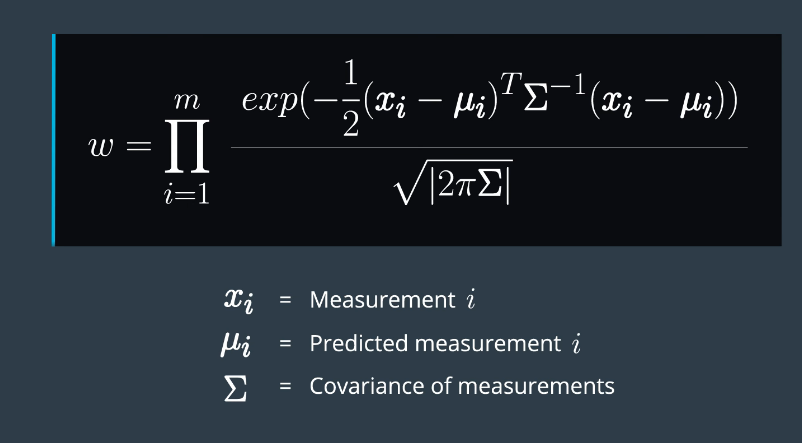

# Kidnapped-Vehicle



## Installation:

The [CarND-Kidnapped-Vehicle-Project](/CarND-Kidnapped-Vehicle-Projects) folder in the repository provides with all the installation steps to ***download and execute the simulator***. 

Once the simulator is installed follow the next steps to run the code:

* Go to the simulator folder.

* Execute the simulator.

```
$ ./term2_sim.x86_64
```

* Select the the third project ***Kidnapped-Vehicle***

* Open another terminal and go to the ***CarND-Kidnapped-Vehicle-Project*** folder execute the following commands:

```
$ ./clean.sh
$ ./build.sh
$ ./run.sh
```

* A "Connected" message should be displayed in the terminal.

* Back to the simulator right click on the run button to start the simulation. 

## Project Description
Implement a **particle filter** to estimate the current position of a simulated car at each time step during the simulation. A message is displayed when the simulation concluded successfully or whether an error occurred, such as running out of time or high error value. 

The following functions were implemented to estimate the car's position:

### Initialize Particles

For the intial position values for the particles, it is common to take the GPS measurements to provide a decent pose of the car, however, it is used only for this step (As an initial guess) due to the high amounts of errors in the measurements. 

The creation of the particles is created randomly using a normal distribution with the mean value of the position provided by the GPS for all the particles. This provides a good random initial estimate for all the particles.

### Prediction of Particles 

For the prediction step the particles' position is estimated after a determined time. The new prediction of the particles' position can be calculate using the **Bycle model** as a representation of the car to simplify the calculations, as shown bellow:



### Data assocition

The measurements of the car might have noisy measurements, this causes a problem when associating the measurements to the actual landmarks. To solve this problem an easy approach is the **Nearest Neightbor** to relate the landmarks with a mesurement.  



### Update Particle Weights

The car's measurements are in the car's coordinate system and the particles positions are in the world coordinate system, the first step to complete is to apply the ***Homogeneous transformation*** to convert car's observation to world coordinates. As shown bellow:



Additionally, we need to calculate the weight each particle using the predicted landmarks and the car's measurements in world coordinate system. This is possible by using the ***Multivariate-Gaussian probability density variables***, as shown bellow:



### Resample the Weigths 

Finally, all the particles weights are normalized and then we apply the ***Resampling Wheel*** algorithm to create a new set of particles for the next iteration.

## Project Outcome
The Car's position estimation had a small error value during the simulation. This reflects the effectiveness of the **particle filter** 

***Important:*** Check the full video of the [Kidnapped-Vehicle](https://youtu.be/f5AMzzcILdo)